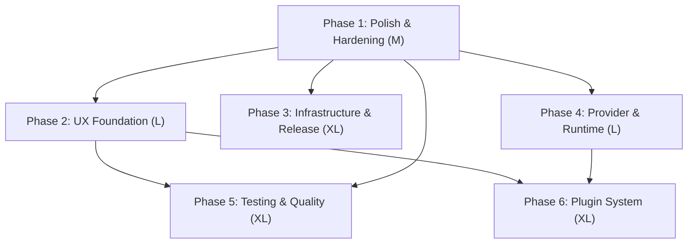
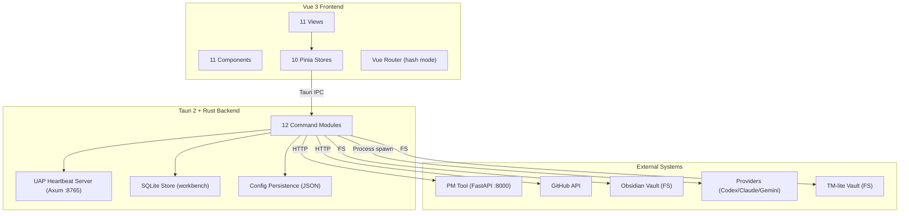

# UMBRA — Steps to Completion

> **Full Evidence-Based Audit & Implementation Plan**
> Generated: 2026-03-26 | Auditor: Forge

---

## What is UMBRA?

**UMBRA** (Unified Management Board for Runtimes & Agents) is a native Windows 11 desktop application that serves as the command center for Clay Machine Games' AI agent ecosystem. It orchestrates agents (Forge, Prism), notes, tasks, skills, cron jobs, IDE launches, GitHub integration, and agent dispatch in a single cyberpunk-themed interface.

**Tech Stack:** Vue 3 + TypeScript + TailwindCSS + Pinia (frontend) | Tauri 2 + Rust (backend) | SQLite (workbench persistence)

**Current Version:** 0.1.0.0 (2026-03-17)

---

## Step 1 — Implementation Status Table

### Frontend Views (11 files)

| File | Status | Evidence |
|------|--------|----------|
| `src/views/DashboardView.vue` | **Partial** | Hardcoded `"12ms"` latency (line 65), fake `"encryption: aes-512-v2"` (line 197), stub filter/export CSV buttons with no handlers (lines 77-78). Core widgets (tasks bar chart, deployment table, attention rail, deadlines, activity timeline) work with real store data. |
| `src/views/AgentsView.vue` | **Complete** | Full agent grid, detail panel, add/remove modals, notes/link persistence, push-task, UAP telemetry panel. Loading/error states handled. All backed by real Tauri commands. |
| `src/views/WorkbenchView.vue` | **Complete** | Dispatch composer, workspace manager, run list, timeline/events viewer with pagination, artifact drilldown, inspector panel, provider onboarding (checklist/auth/smoke/bootstrap), run lifecycle (create/cancel/retry/continue). Fully wired to Tauri backend. |
| `src/views/OpsRoomView.vue` | **Complete** | Channel CRUD, message thread with pagination, agent presence, job creation from messages, approval workflow, routing rules, session templates, session lifecycle, escalation rail, provider onboarding sidebar, workspace manager. All wired. |
| `src/views/NotesView.vue` | **Complete** | Note list with search/category filter, NoteEditor integration (split/preview/markdown modes), create/save/delete, autosave with 700ms debounce, quick-link groups. Backed by Tauri note commands. |
| `src/views/LauncherView.vue` | **Complete** | IDE launch targets, GitHub repo dropdown from API, pinned repos with live issue count, open repo/issues/PRs, open local folder/terminal, clipboard copy (path/HTTPS/SSH), repo health indicator. All Tauri-backed. |
| `src/views/TasksView.vue` | **Complete** | Kanban board with 4 columns, drag-and-drop between lanes, project filter, sort by priority, lane collapse with config persistence, quick move buttons, create/edit task modals, add comment, sync. All PM Tool API-backed. |
| `src/views/CronView.vue` | **Complete** | Summary metrics, agent-grouped job listing, job detail cards, API documentation section, refresh with live updates. Backed by `useCronStore` + Tauri commands. |
| `src/views/PluginsView.vue` | **Partial** | Obsidian stats, TM-lite tasks, GitHub health, assignment broker all work via real Tauri calls. "Next Plugins" roadmap section (lines 215-236) is hardcoded static content. |
| `src/views/SkillsView.vue` | **Complete** | Skill grid with category/agent filtering, full-text search, skill detail modal with SKILL.MD content, keyboard navigation (arrows/J/K/Escape), refresh. Tauri-backed via `list_skills`. |
| `src/views/SettingsView.vue` | **Complete** | Theme switcher, system tray toggle, Obsidian vault path, launch targets CRUD, workspace presets CRUD, persona presets CRUD, provider command config (auth/checklist/smoke/bootstrap per provider), GitHub PAT + targets, PM tool URL + poll interval, UAP config, update checker. All Tauri-backed. |

### Frontend Components (11 files)

| File | Status | Evidence |
|------|--------|----------|
| `src/components/agents/AgentCard.vue` | **Complete** | Agent monogram, name, role, skills (max 4 + overflow), status badge, last-seen, tool count. Uses GlassCard + StatusBadge. |
| `src/components/atmosphere/EmberCanvas.vue` | **Complete** | 25-particle canvas system, 20fps cap, CSS theme variable reading via MutationObserver + ResizeObserver, `prefers-reduced-motion` support. |
| `src/components/layout/AppLayout.vue` | **Complete** | Shell layout (CustomTitlebar + AppSidebar + RouterView + CommandPalette), error boundary via `onErrorCaptured`, `tray-sync-pm` event listener, global error handler. |
| `src/components/layout/AppSidebar.vue` | **Complete** | 11 navigation items with inline SVG icons, reactive badges (active task count), footer with connection status, active tasks, online agents. Data-driven from stores. |
| `src/components/layout/CustomTitlebar.vue` | **Complete** | Minimize/maximize/close via Tauri `getCurrentWindow()`. Browser-safe fallback via `__TAURI_INTERNALS__` check. Draggable via `data-tauri-drag-region`. |
| `src/components/layout/ViewHero.vue` | **Complete** | Reusable page header (kicker, title, subtitle), theme cycle button, slot for custom meta, light theme overrides. |
| `src/components/notes/NoteEditor.vue` | **Complete** | 925-line editor. Split/preview/markdown modes. `marked` + `DOMPurify` rendering. Mermaid diagram support (lazy-loaded). `umbra://` protocol link rendering. Attachments (file picker, paste, drag-and-drop). Category CRUD. Quick-link insertion. Autosave indicators. |
| `src/components/shell/CommandPalette.vue` | **Complete** | Teleported overlay, Ctrl+K toggle, Alt+1-7 quick nav, Ctrl+Shift+N new note, arrow key navigation, Enter to execute. Dispatches to router or Tauri invoke by entry kind. |
| `src/components/ui/GlassCard.vue` | **Complete** | Glassmorphism card. Variants: default/accent/danger. Clickable mode with hover glow. Light theme support. |
| `src/components/ui/NeonButton.vue` | **Complete** | Variants (primary/secondary/danger), sizes (sm/md/lg), ghost mode, loading spinner. Light theme support. |
| `src/components/ui/StatusBadge.vue` | **Complete** | 5 status states (online/working/idle/offline/error) with animated dot indicators. Light theme overrides. |

### Frontend Stores (10 files)

| File | Status | Evidence |
|------|--------|----------|
| `src/stores/useAgentStore.ts` | **Complete** | Real Tauri invokes (`get_agents`, `add_agent`, `remove_agent`, `push_agent_task`), caching via `useCache`, live updates via `listen("agent-status-changed")`. |
| `src/stores/useCommandPaletteStore.ts` | **Complete** | Fuzzy-search across 6 stores (notes, tasks, agents, github, config, skills). Scoring, pagination (MAX_RESULTS=14), lazy-load bootstrap. 318 lines. |
| `src/stores/useConfigStore.ts` | **Complete** | `invoke("get_config")` / `invoke("save_config")`. Theme switching via `document.documentElement.setAttribute`. |
| `src/stores/useCronStore.ts` | **Complete** | `invoke("list_agent_cron_jobs")`, live updates via `listen("agent-cron-updated")`. Read-only. |
| `src/stores/useGithubStore.ts` | **Complete** | `invoke("get_github_repos")`, `repoById` helper. Read-only. |
| `src/stores/useNotesStore.ts` | **Complete** | Full CRUD (`loadNotes`, `saveNote`, `deleteNote`, `newNote`), category filtering, search. All via Tauri invoke. |
| `src/stores/useOpsStore.ts` | **Complete** | 442 lines. Channels, messages (paginated), jobs, approvals, sessions, templates, rules, draft composer. 9 Tauri event listeners. Full Ops Room state. |
| `src/stores/useSkillsStore.ts` | **Complete** | `invoke("list_skills")`, selection state. |
| `src/stores/useTaskStore.ts` | **Complete** | `invoke("get_pm_tasks")`, live updates via `listen("tasks-updated")`. `activeTasks()` / `todoTasks()` helpers. |
| `src/stores/useWorkbenchStore.ts` | **Complete** | 265 lines. Runs, events (paginated), artifacts. `createRun`, `cancelRun`, `retryRun`. Draft validation (`canSend`). Run continuation. 4 Tauri event listeners. |

### Frontend Lib / Support (7 files)

| File | Status | Evidence |
|------|--------|----------|
| `src/interfaces/index.ts` | **Complete** | 422 lines. 40+ TypeScript interfaces/types covering all data models. No placeholders. |
| `src/lib/tauri-mock.ts` | **Complete (Mock)** | Intentional browser-mode test shim. Hardcoded seed data for 2 agents, 1 task, 1 channel, 2 runs. 40+ command handlers. `__reset_tauri_mock__` for test resets. Not production code. |
| `src/lib/providers.ts` | **Complete** | `deriveProviderIdFromAgentId` — maps agent ID prefixes to provider IDs. |
| `src/lib/workspaces.ts` | **Complete** | `createEmptyWorkspacePreset`, `normalizeWorkspacePresets`, `mergeWorkspaceGrantRoots`, `buildWorkspaceConfigUpdate`. Pure logic. |
| `src/lib/assignment-broker.ts` | **Complete** | Scoring algorithm for agent-task assignment suggestions. Considers priority, status, skill overlap, agent load. |
| `src/router/index.ts` | **Complete** | Hash router, 11 routes. Dashboard eager, all others lazy-loaded. |
| `src/App.vue` + `src/main.ts` | **Complete** | Standard Vue 3 bootstrap. Config load on mount, update check, global error handlers. |

### Rust Backend — Core (5 files)

| File | Status | Evidence |
|------|--------|----------|
| `src-tauri/src/lib.rs` | **Complete** | Tauri app bootstrap: tray icon with health snapshots, agent registry seeding, cron scheduler, UAP server, window management, close-to-tray. 2 unit tests. |
| `src-tauri/src/state.rs` | **Complete** | `AppState` with `RwLock<AppConfig>`, GitHub cache, agent registry, workbench store (SQLite), active run registry (PID tracking). |
| `src-tauri/src/types.rs` | **Complete** | All data models. Minor issue: `is_stale()` doc comment says "90 seconds" but checks 1800 seconds (30 minutes). |
| `src-tauri/src/errors.rs` | **Complete** | `AppError` enum with 8 variants via `thiserror`. Custom `Serialize` impl for Tauri. |
| `src-tauri/src/uap.rs` | **Complete** | Axum HTTP server: `POST /api/agents/{id}/heartbeat`, `GET /api/agents/{id}/tasks`, `POST /api/agents/{id}/cron-jobs`. Token auth. 2 unit tests. |

### Rust Backend — Commands (12 files)

| File | Status | Evidence |
|------|--------|----------|
| `src-tauri/src/commands/agents.rs` | **Complete** | `get_agents`, `add_agent`, `remove_agent`, `push_agent_task`, `default_agents`, `custom_agent_to_agent`. 3 unit tests. |
| `src-tauri/src/commands/config.rs` | **Complete** | `get_config`, `save_config`, `load_config`. 30-field `AppConfig` with full `normalize()`. 2 tests. |
| `src-tauri/src/commands/github.rs` | **Complete** | `get_github_repos` (cached), `list_user_repos` (PAT-authenticated). Returns `Result<_, String>` (inconsistent). 2 tests. |
| `src-tauri/src/commands/integrations.rs` | **Complete** | 8 PM Tool commands with verify-after-write pattern. 5s HTTP timeout. 7 tests. |
| `src-tauri/src/commands/launcher.rs` | **Complete** | 5 launch commands. Whitelist enforcement, shell metacharacter rejection, path traversal prevention. 4 tests. |
| `src-tauri/src/commands/notes.rs` | **Complete** | 4 note commands. YAML frontmatter, path traversal prevention, Windows reserved name rejection, attachment handling with MIME inference. 8 tests. |
| `src-tauri/src/commands/plugins.rs` | **Complete** | `get_obsidian_stats`, `get_tmlite_tasks`, `list_skills`. Issue: `infer_skill_agents` still references removed "jim" agent. |
| `src-tauri/src/commands/updates.rs` | **Complete** | `check_for_updates`, `install_pending_update`. Tauri updater integration. 3 `Mutex::lock().unwrap()` calls. 2 tests. |
| `src-tauri/src/commands/cron.rs` | **Complete** | 6 cron commands. `run_cron_job_now` uses `cmd /C` (Windows-only). No tests. |
| `src-tauri/src/commands/ops_room.rs` | **Complete** | 18 Ops Room commands. Channel CRUD, messaging, jobs, approvals, rules, sessions. Complex routing logic with `@mentions`, session turns, rules. No tests. |
| `src-tauri/src/commands/workbench.rs` | **Complete** | 20+ workbench commands. 11 validation checks on `create_dispatch_run`. Provider probe/smoke/auth/bootstrap. `include_str!` for instruction templates. No tests. |
| `src-tauri/src/commands/mod.rs` | **Complete** | Module re-exports only. |

### Rust Backend — Workbench Engine (4 files)

| File | Status | Evidence |
|------|--------|----------|
| `src-tauri/src/workbench/mod.rs` | **Complete** | Module declarations. |
| `src-tauri/src/workbench/adapters.rs` | **Complete** | CLI execution plans for Codex (with WSL fallback), Claude (`-p` mode), Gemini. Kimi returns empty plans (not wired). 4 tests. |
| `src-tauri/src/workbench/runner.rs` | **Complete** | Full provider process lifecycle: spawn, stdin/stdout/stderr streaming, cancellation, artifact extraction, result contract parsing, persona injection, linked job/session sync. 7 tests. |
| `src-tauri/src/workbench/store.rs` | **Complete** | SQLite persistence. 10 tables, full CRUD, transactions, cursor-based pagination, recovery of incomplete runs. No tests. |

### Configuration & Infrastructure

| File | Status | Evidence |
|------|--------|----------|
| `src-tauri/tauri.conf.json` | **Partial** | Window config complete (1400x900, frameless, transparent). Updater present but non-functional (empty pubkey/endpoints). CSP is `null` (security concern). |
| `src-tauri/capabilities/default.json` | **Complete** | Core + window + shell:allow-open permissions. Minimal and appropriate. |
| `package.json` | **Complete** | 18 dependencies, 9 npm scripts including test, e2e, release:portable, release:win. |
| `Cargo.toml` | **Complete** | ~15 crates. Release profile optimized (LTO, strip, size-opt). |
| `vite.config.ts` | **Complete** | Vue plugin, port 1430, Tauri mock shims for browser preview, Vitest config. |
| `tailwind.config.ts` | **Partial** | Minimal config. Theming done via CSS custom properties in `base.css` instead. Missing BRAND.md v2.1 font families. |
| `README.md` | **Outdated** | Only lists MVP features. No mention of Workbench, Ops Room, Notes, Cron, themes, tray, or any Phase 2+ work. |
| `CHANGELOG.md` | **Outdated** | Single entry (v0.1.0.0). Phase 5-8 work not recorded. |

### CSS / Design System (3 files)

| File | Status | Evidence |
|------|--------|----------|
| `src/assets/styles/base.css` | **Complete** | Full BRAND.md v2.1 token system: 3 themes (Ember/Neon/Light), fonts (Barlow Condensed, Inter, JetBrains Mono), glass/glow tokens, layout vars, ambient glows, `prefers-reduced-motion`, custom scrollbar. |
| `src/assets/styles/glassmorphism.css` | **Complete** | `.glass-card`, `.glass-panel`, `.glass-input` with light theme overrides. |
| `src/assets/styles/neon.css` | **Complete** | `.neon-text`, `.neon-border`, `.neon-btn`, pulse animations, scanline overlay. |

---

## Step 2 — Feature Completeness Assessment

### Feature Map

| Feature | Intended Behavior | Current State | Gap |
|---------|-------------------|---------------|-----|
| **Agent Registry** | List all agents, live status via UAP heartbeats, add/remove agents | **Complete** | None |
| **Agent Detail Panel** | Skills, tools, status, notes, links, push task | **Complete** | None |
| **UAP Heartbeat Server** | Axum server on port 8765, token auth, agent lifecycle | **Complete** | None |
| **Dashboard Overview** | Quick metrics, task chart, deployment table, attention rail, activity | **Partial** | Hardcoded "12ms" latency, fake "aes-512-v2" string, stub filter/export buttons |
| **Workbench Dispatch** | Compose prompt, select agent/workspace/mode, dispatch to provider | **Complete** | None |
| **Workbench Run History** | SQLite-backed run timeline with events, artifacts, pagination | **Complete** | None |
| **Workbench Provider Setup** | Probe, auth check, smoke test, bootstrap per provider | **Complete** | Kimi provider not wired (returns empty plans) |
| **Ops Room Channels** | Multi-channel messaging for agent coordination | **Complete** | None |
| **Ops Room Jobs** | Create jobs from messages, assign to agents, track results | **Complete** | None |
| **Ops Room Routing** | @mention routing, rules with human gate, session turns | **Complete** | None |
| **Ops Room Sessions** | Session templates, turn-based agent rotation | **Complete** | None |
| **Notes Editor** | Markdown split-view editor with Mermaid, attachments, categories | **Complete** | None |
| **Notes Vault Sync** | Bidirectional sync with Obsidian vault | **Complete** | None |
| **Task Kanban Board** | 4-column board from PM Tool with drag-and-drop | **Complete** | None |
| **Cron Job Manager** | List agent cron jobs, run now, enable/disable | **Complete** | None |
| **Skills Browser** | Search/filter skills from `~/.claude/skills/` | **Complete** | None |
| **IDE Launcher** | Launch VSCode/Godot, open repos, clone URLs | **Complete** | None |
| **GitHub Integration** | Repo browser with issues, PRs, health indicator | **Complete** | None |
| **Integration Status** | Obsidian stats, TM-lite tasks, GitHub health | **Complete** | Roadmap section is static |
| **Theme System** | 3 themes (Ember/Neon/Light) with live switching | **Complete** | None |
| **Command Palette** | Ctrl+K global search across all entities | **Complete** | None |
| **System Tray** | Minimize to tray, health snapshot, quick actions | **Complete** | None |
| **Custom Titlebar** | Frameless window with min/max/close | **Complete** | None |
| **Ember Particle Canvas** | Ambient particle background animation | **Complete** | None |
| **Settings Panel** | All config: theme, paths, presets, providers, GitHub, PM, UAP | **Complete** | None |
| **Auto-Updater** | Check for updates, install pending | **Partial** | Updater code exists but `tauri.conf.json` has empty pubkey/endpoints |
| **First-Run Onboarding** | Guide new users through vault path, GitHub PAT, PM tool setup | **Missing** | Not implemented |
| **Notification System** | Toast + Windows desktop notifications | **Missing** | Not implemented |
| **Windows Credential Manager** | Secure secret storage for PAT/tokens | **Missing** | Secrets stored in plain config JSON |
| **Plugin System (Extensible)** | Widget architecture for third-party plugins | **Missing** | Only integration status cards exist; no plugin loading/execution framework |
| **CI/CD Build Pipeline** | GitHub Actions for Windows MSI/portable builds | **Missing** | Scripts exist locally but no CI/CD pipeline |
| **README / Docs** | Up-to-date documentation reflecting current features | **Outdated** | README shows only MVP features; CHANGELOG missing Phase 5-8 |
| **Cross-platform Cron Exec** | Execute cron jobs on any OS | **Partial** | `cmd /C` hardcoded — Windows-only |
| **Kimi Provider** | Dispatch to Kimi CLI agent | **Missing** | Adapter returns empty plans |
| **Per-Agent Identity** | Individual tokens per agent instead of global UAP token | **Missing** | Global token only |

### Overall Completion Estimate: **78%**

The core application — agent management, dispatch workbench, ops room, notes, tasks, cron, skills, launcher, GitHub, settings — is fully implemented with real backend logic, SQLite persistence, and live event updates. The remaining 22% consists of infrastructure hardening (updater, secrets, CI/CD), missing auxiliary features (onboarding, notifications, plugin framework), documentation debt, and minor polish items (dashboard stubs, Kimi adapter).

---

## Step 3 — UI/UX Audit

### UI/UX Audit Table

| Screen / Component | Issue | Severity | Fix Required |
|--------------------|-------|----------|--------------|
| **DashboardView** | "12ms" hardcoded latency value — misleading metric | High | Replace with real metric or remove entirely |
| **DashboardView** | "encryption: aes-512-v2" — fake, AES-512 doesn't exist | Med | Replace with real system info or remove |
| **DashboardView** | Filter + Export CSV buttons are non-functional stubs | Med | Either implement handlers or remove buttons |
| **PluginsView** | "Next Plugins" roadmap section is static hardcoded content | Low | Acceptable as roadmap display; label as "Planned" |
| **All Views** | No consistent loading skeleton/spinner pattern — each view handles loading differently | Med | Implement shared `LoadingState` component |
| **All Views** | No toast/notification system for action feedback | High | Implement global toast system for save/delete/error feedback |
| **SettingsView** | Save button shows brief success text but no persistent toast | Med | Use toast notification system |
| **DashboardView** | No empty state illustration — just text when sections are empty | Low | Add illustration or icon to empty states |
| **All Views** | No first-run onboarding flow — new user sees empty dashboard | High | Implement first-run wizard or guided setup |
| **NoteEditor** | 925-line single component — complex but functional | Low | Could be split for maintainability but works |
| **base.css** | Only `Iceland` font loaded as `@font-face`; Barlow Condensed, Inter, JetBrains Mono declared in CSS vars but not loaded | Med | Either load via @font-face or use system fallbacks explicitly |
| **tailwind.config.ts** | Minimal config doesn't reflect BRAND.md token system | Low | CSS custom properties handle theming; Tailwind config is supplementary |
| **tauri.conf.json** | CSP is `null` — no content security policy | High | Set appropriate CSP for production security |
| **All Views** | Consistent keyboard navigation (Escape to close modals) but no visible keyboard shortcut hints | Low | Add shortcut hints in tooltips |
| **Sidebar** | Active route indicator uses accent color but no other visual differentiation (bold, background) on light theme | Low | Enhance active state contrast on light theme |

### UI/UX Priority List (Top 5 Highest Impact)

1. **Global toast/notification system** — Every action (save, delete, error, network failure) lacks consistent user feedback. Users don't know if actions succeeded.

2. **First-run onboarding wizard** — New users see an empty dashboard with no guidance on setting up vault path, GitHub PAT, PM Tool URL, or workspace presets. Critical for adoption.

3. **Dashboard cleanup** — Remove fake data ("12ms", "aes-512-v2"), implement or remove stub buttons. The dashboard is the first screen users see.

4. **Content Security Policy** — `null` CSP in production is a security risk. Must be set before any public release.

5. **Consistent loading states** — Each view handles loading differently. A shared loading/skeleton component would improve perceived quality.

---

## Step 4 — Phase Plan

### Phase 1: Polish & Hardening
**Goal:** Fix all fake data, stub buttons, and security issues so the existing features are production-grade.
**Completion criterion:** Dashboard shows only real data, CSP is set, all interactive elements work, README and CHANGELOG are current.
**Effort estimate:** M
**Prerequisite phases:** None

**Included work:**
- Dashboard: remove hardcoded "12ms" and "aes-512-v2", implement or remove filter/export buttons
- Security: set CSP in `tauri.conf.json`
- Backend: fix `types.rs` is_stale doc comment, remove "jim" reference from `plugins.rs`
- Backend: make error return types consistent (`AppError` everywhere)
- Docs: update README with current features, update CHANGELOG with Phase 5-8 work
- UI/UX: standardize empty states across all views

### Phase 2: User Experience Foundation
**Goal:** Implement first-run onboarding, global toast notifications, and consistent loading states so the app is usable by someone who didn't build it.
**Completion criterion:** New user can complete setup wizard, all actions show toast feedback, loading states are consistent.
**Effort estimate:** L
**Prerequisite phases:** Phase 1

**Included work:**
- Feature: first-run onboarding wizard (vault path, GitHub PAT, PM Tool URL, workspace preset)
- Feature: global toast notification system (success/error/warning)
- Feature: shared `LoadingState` / skeleton component used across all views
- UI/UX: consistent action feedback (save, delete, sync, error)

### Phase 3: Infrastructure & Release Pipeline
**Goal:** Auto-updater works end-to-end, secrets are secure, CI/CD builds UMBRA automatically.
**Completion criterion:** `check_for_updates` fetches from real endpoint, secrets use Windows Credential Manager, GitHub Actions builds MSI + portable.
**Effort estimate:** XL
**Prerequisite phases:** Phase 1

**Included work:**
- Setup: configure Tauri updater (pubkey, endpoints, signing)
- Security: Windows Credential Manager integration for PAT/tokens
- CI/CD: GitHub Actions workflow for Windows MSI + portable builds
- Setup: Windows autostart on login (optional)
- Deploy: first real release v0.2.0

### Phase 4: Provider & Runtime Completion
**Goal:** All four provider adapters (Codex, Claude, Gemini, Kimi) work end-to-end, per-agent identity replaces global token.
**Completion criterion:** Kimi dispatch succeeds, each agent has its own UAP token, cron execution is cross-platform.
**Effort estimate:** L
**Prerequisite phases:** Phase 1

**Included work:**
- Adapter: wire Kimi CLI adapter in `adapters.rs`
- Security: per-agent UAP tokens instead of global token
- Backend: cross-platform cron execution (replace `cmd /C` with platform detection)
- Backend: add `@font-face` loading for Barlow Condensed, Inter, JetBrains Mono or confirm system fallbacks

### Phase 5: Testing & Quality
**Goal:** Comprehensive test coverage across Rust commands, Vue components, and E2E browser flows.
**Completion criterion:** Rust: all command modules have unit tests. Vue: component tests for all views. E2E: critical user flows covered.
**Effort estimate:** XL
**Prerequisite phases:** Phase 1, Phase 2

**Included work:**
- Testing: Rust unit tests for `cron.rs`, `ops_room.rs`, `workbench.rs`, `store.rs`
- Testing: Vue component tests expanded (move beyond store-only coverage)
- Testing: E2E test suite for critical flows (onboarding, dispatch, task board, notes)
- Testing: replace Mutex unwraps in `updates.rs` with proper error handling

### Phase 6: Plugin System & Extensibility
**Goal:** Plugin framework allows third-party widgets and integrations beyond the built-in four.
**Completion criterion:** A plugin can be loaded, rendered in PluginsView, and interact with UMBRA APIs.
**Effort estimate:** XL
**Prerequisite phases:** Phase 2, Phase 4

**Included work:**
- Architecture: plugin loading/execution framework
- Frontend: plugin widget renderer in PluginsView
- Backend: plugin API surface (read config, invoke commands, emit events)
- Docs: plugin development guide

### Phase Dependency Diagram

---

## Step 5 — Agent-Ready Task Breakdown

### Task: Remove hardcoded fake data from DashboardView

**Phase:** Phase 1: Polish & Hardening
**Area:** Frontend
**Description:** In `src/views/DashboardView.vue`, remove the hardcoded `"12ms"` latency value (line 65) and the `"encryption: aes-512-v2"` fake telemetry string (line 197). Replace the latency card with a real metric (e.g., PM Tool response time from last poll, or last UAP heartbeat latency) or remove the card entirely. Remove the fake encryption string from the telemetry strip.
**Inputs:** `src/views/DashboardView.vue`, `src/stores/useAgentStore.ts`, `src/stores/useTaskStore.ts`
**Outputs:** Updated `DashboardView.vue` with real or removed metrics
**Acceptance criteria:**
- [ ] No hardcoded "12ms" string appears in the codebase
- [ ] No "aes-512-v2" string appears in the codebase
- [ ] Dashboard still renders correctly with all real data widgets
- [ ] Vitest passes (`npm run test`)
**Effort:** XS
**Depends on:** none
**Do NOT:** Add new features to the dashboard; only fix existing fake data

---

### Task: Implement or remove stub filter/export buttons on Dashboard

**Phase:** Phase 1: Polish & Hardening
**Area:** Frontend
**Description:** In `src/views/DashboardView.vue` (lines 77-78), the "filter" and "export csv" buttons have no click handlers and do nothing. Either implement CSV export of the deployment registry table (generate CSV string, trigger download via Tauri dialog) and a filter dropdown, OR remove the buttons entirely to avoid misleading users.
**Inputs:** `src/views/DashboardView.vue`, deployment registry data from `useTaskStore`
**Outputs:** Updated `DashboardView.vue` — buttons either functional or removed
**Acceptance criteria:**
- [ ] No non-functional buttons remain on the Dashboard
- [ ] If implemented: CSV download works and filter narrows table rows
- [ ] Vitest passes
**Effort:** S
**Depends on:** none
**Do NOT:** Redesign the dashboard layout

---

### Task: Set Content Security Policy in tauri.conf.json

**Phase:** Phase 1: Polish & Hardening
**Area:** Infrastructure
**Description:** In `src-tauri/tauri.conf.json`, the CSP is set to `null`. Configure a restrictive CSP that allows: self-hosted scripts/styles, Tauri IPC (`ipc:` scheme), inline styles (required by Vue), image sources from the file system and data URIs. Block external script/style loading.
**Inputs:** `src-tauri/tauri.conf.json`, Tauri 2 CSP documentation
**Outputs:** Updated `tauri.conf.json` with production CSP
**Acceptance criteria:**
- [ ] CSP is not null
- [ ] App loads and functions correctly with the CSP in place
- [ ] External script injection is blocked
- [ ] All current features (markdown preview, Mermaid, EmberCanvas) still work
**Effort:** S
**Depends on:** none
**Do NOT:** Modify any Rust backend code

---

### Task: Fix is_stale doc comment and remove jim agent reference

**Phase:** Phase 1: Polish & Hardening
**Area:** Backend
**Description:** 1) In `src-tauri/src/types.rs`, the `is_stale()` method's doc comment says "90 seconds" but the actual threshold is 1800 seconds (30 minutes). Fix the comment. 2) In `src-tauri/src/commands/plugins.rs`, `infer_skill_agents` (around lines 301-309) still references the removed "jim" agent for keyword matching. Remove the jim entry from the inference map.
**Inputs:** `src-tauri/src/types.rs`, `src-tauri/src/commands/plugins.rs`
**Outputs:** Updated files with corrected docs and removed jim reference
**Acceptance criteria:**
- [ ] `is_stale()` doc comment matches the actual threshold (1800 seconds / 30 minutes)
- [ ] No "jim" string appears in `infer_skill_agents`
- [ ] `cargo test` passes
**Effort:** XS
**Depends on:** none
**Do NOT:** Change the actual stale timeout value

---

### Task: Standardize Rust error return types to AppError

**Phase:** Phase 1: Polish & Hardening
**Area:** Backend
**Description:** `github.rs` and `plugins.rs` return `Result<_, String>` while all other command files return `Result<_, AppError>`. Update `get_github_repos`, `list_user_repos`, and `list_skills` to return `Result<_, AppError>` using proper `AppError` variants instead of `String::from(...)`.
**Inputs:** `src-tauri/src/commands/github.rs`, `src-tauri/src/commands/plugins.rs`, `src-tauri/src/errors.rs`
**Outputs:** Updated command files with consistent `AppError` returns
**Acceptance criteria:**
- [ ] All commands return `Result<_, AppError>`
- [ ] No command returns `Result<_, String>`
- [ ] `cargo test` passes
- [ ] Frontend still receives error messages correctly
**Effort:** S
**Depends on:** none
**Do NOT:** Change the logic of the commands, only the error types

---

### Task: Update README with current features

**Phase:** Phase 1: Polish & Hardening
**Area:** Documentation
**Description:** `README.md` only lists MVP features (Agent Overview, Skills Browser, PM Tool, IDE Launcher, Plugin System). It does not mention: Workbench dispatch, Ops Room, Notes editor, Cron jobs, Theme system (Ember/Neon/Light), System tray, Command palette, Auto-updater, or the current architecture. Rewrite to reflect the actual v0.1.0+ feature set. Include screenshots placeholder paths, updated architecture overview, and correct PM Tool URL (`100.115.61.30:8000`).
**Inputs:** `README.md`, all view files for feature reference
**Outputs:** Updated `README.md`
**Acceptance criteria:**
- [ ] All 11 views are described
- [ ] Architecture section reflects Tauri 2 + Rust + Vue 3 stack
- [ ] PM Tool URL is `100.115.61.30:8000` (not localhost:4173)
- [ ] No mention of features that don't exist
**Effort:** S
**Depends on:** none
**Do NOT:** Create new documentation files; only update the existing README

---

### Task: Update CHANGELOG with Phase 5-8 work

**Phase:** Phase 1: Polish & Hardening
**Area:** Documentation
**Description:** `CHANGELOG.md` has a single entry for v0.1.0.0 covering Phase 2-4. The following work is not recorded: Workbench MVP (dispatch, SQLite store, provider adapters), Ops Room (channels, messaging, jobs, sessions, rules), Phase 8 UI pass (workspace actions, composer redesign), command palette, tray health improvements. Add entries for all completed phases.
**Inputs:** `CHANGELOG.md`, `docs/agent-workbench-roadmap-2026-03-26.md`, `docs/phase-8-ui-workspace-plan-2026-03-26.md`
**Outputs:** Updated `CHANGELOG.md` with Phase 5-8 entries
**Acceptance criteria:**
- [ ] All completed features from Phase 5-8 are documented
- [ ] Each entry follows the existing changelog format
- [ ] No unreleased or planned features are listed as done
**Effort:** S
**Depends on:** none
**Do NOT:** Bump the version number

---

### Task: Implement global toast notification system

**Phase:** Phase 2: UX Foundation
**Area:** Frontend / UI/UX
**Description:** Create a `ToastNotification.vue` component and a `useToastStore.ts` Pinia store. The toast system should support 4 types (success, error, warning, info), auto-dismiss after 4 seconds, stack up to 3 toasts, and be callable from any view via `toastStore.show({ type, message })`. Mount the toast container in `AppLayout.vue`. Replace existing inline success/error messages in SettingsView, NotesView, TasksView, and WorkbenchView with toast calls.
**Inputs:** `src/components/layout/AppLayout.vue`, existing inline feedback patterns in views
**Outputs:** `src/components/ui/ToastNotification.vue`, `src/stores/useToastStore.ts`, updated `AppLayout.vue`
**Acceptance criteria:**
- [ ] `toastStore.show({ type: 'success', message: 'Saved' })` shows a toast
- [ ] Toasts auto-dismiss after 4 seconds
- [ ] Maximum 3 toasts visible simultaneously
- [ ] All 4 types have distinct styling (colors match theme tokens)
- [ ] Works on all 3 themes (Ember/Neon/Light)
- [ ] Existing inline success messages in SettingsView are replaced
**Effort:** M
**Depends on:** none
**Do NOT:** Add toast calls to every view in this task — only the toast system itself and SettingsView migration

---

### Task: Implement first-run onboarding wizard

**Phase:** Phase 2: UX Foundation
**Area:** Frontend / UI/UX
**Description:** Create a `FirstRunWizard.vue` modal component that appears on first launch (when config has no vault path, no GitHub PAT, and no workspace presets). The wizard should have 4 steps: (1) Welcome + Obsidian vault path selection, (2) GitHub PAT entry, (3) PM Tool URL, (4) Create first workspace preset. Each step validates input before proceeding. On completion, save config via `configStore.saveConfig()` and dismiss the wizard permanently (set a `firstRunComplete: true` flag in config).
**Inputs:** `src/stores/useConfigStore.ts`, `src/interfaces/index.ts` (AppConfig), `src/views/SettingsView.vue` (reference for form fields)
**Outputs:** `src/components/shell/FirstRunWizard.vue`, updated `AppConfig` interface with `firstRunComplete` field, mount point in `AppLayout.vue`
**Acceptance criteria:**
- [ ] Wizard appears on first launch when config is empty
- [ ] Wizard does not appear when `firstRunComplete` is true
- [ ] Each step validates input (vault path exists, PAT format, URL format)
- [ ] Config is saved after wizard completion
- [ ] Wizard can be dismissed/skipped without completing all steps
- [ ] Renders correctly on all 3 themes
**Effort:** L
**Depends on:** "Implement global toast notification system"
**Do NOT:** Modify the Settings view; the wizard is a separate flow

---

### Task: Implement shared LoadingState component

**Phase:** Phase 2: UX Foundation
**Area:** Frontend / UI/UX
**Description:** Create a `LoadingState.vue` component that provides consistent loading UX. Support 3 modes: (1) spinner with optional message, (2) skeleton placeholders (for cards/lists), (3) inline loading indicator (for buttons). Use this component in at least DashboardView, AgentsView, and TasksView to replace their current ad-hoc loading states.
**Inputs:** Current loading patterns across views (e.g., `v-if="agentStore.loading"`)
**Outputs:** `src/components/ui/LoadingState.vue`, updated views
**Acceptance criteria:**
- [ ] Component supports spinner, skeleton, and inline modes
- [ ] DashboardView uses the new component
- [ ] AgentsView uses the new component
- [ ] TasksView uses the new component
- [ ] Consistent appearance across all 3 themes
**Effort:** M
**Depends on:** none
**Do NOT:** Refactor all 11 views — only the 3 specified

---

### Task: Configure Tauri auto-updater with real endpoints

**Phase:** Phase 3: Infrastructure & Release Pipeline
**Area:** Infrastructure
**Description:** In `src-tauri/tauri.conf.json`, configure the Tauri updater plugin with: (1) a real Ed25519 public key for signature verification, (2) GitHub Releases as the update endpoint (using `https://github.com/CMG-AI/UMBRA/releases/latest/download/latest.json` or equivalent), (3) generate the corresponding private key and store it as a GitHub Actions secret. Update `src-tauri/src/commands/updates.rs` if needed to handle the configured endpoint format.
**Inputs:** `src-tauri/tauri.conf.json`, `src-tauri/src/commands/updates.rs`, Tauri updater docs
**Outputs:** Updated `tauri.conf.json` with real updater config, key generation instructions
**Acceptance criteria:**
- [ ] `tauri.conf.json` updater has non-empty `pubkey` and `endpoints`
- [ ] `check_for_updates` command successfully queries the endpoint
- [ ] Signature verification works with the generated keypair
**Effort:** M
**Depends on:** none
**Do NOT:** Implement GitHub Actions in this task — that's a separate task

---

### Task: Implement Windows Credential Manager for secrets

**Phase:** Phase 3: Infrastructure & Release Pipeline
**Area:** Backend / Security
**Description:** Currently, GitHub PAT and UAP agent token are stored in plain JSON config at `%APPDATA%/com.cmg.umbra/config.json`. Implement Windows Credential Manager integration using the `keyring` or `windows-credentials` Rust crate. Store sensitive values (GitHub PAT, UAP token) in the OS credential store. Update `config.rs` to read/write secrets from the credential manager instead of the config file. Provide fallback to plain config for non-Windows platforms.
**Inputs:** `src-tauri/src/commands/config.rs`, `src-tauri/Cargo.toml`
**Outputs:** Updated `config.rs` with credential manager calls, new Cargo dependency
**Acceptance criteria:**
- [ ] GitHub PAT is stored in Windows Credential Manager
- [ ] UAP agent token is stored in Windows Credential Manager
- [ ] Secrets are not written to the JSON config file
- [ ] `cargo test` passes
- [ ] Settings view can still read/write PAT and token
**Effort:** L
**Depends on:** none
**Do NOT:** Change the config file format for non-secret fields

---

### Task: Create GitHub Actions CI/CD pipeline for Windows builds

**Phase:** Phase 3: Infrastructure & Release Pipeline
**Area:** Infrastructure
**Description:** Create `.github/workflows/build.yml` that: (1) runs on push to main and PRs, (2) installs Rust + Node.js + Tauri CLI, (3) runs `cargo test`, (4) runs `npm run test`, (5) builds MSI installer via `npm run release:win`, (6) builds portable exe via `npm run release:portable`, (7) uploads artifacts. Add a release workflow that triggers on version tags and creates a GitHub Release with the built artifacts.
**Inputs:** `package.json` scripts, `Cargo.toml`, build scripts in `scripts/`
**Outputs:** `.github/workflows/build.yml`, `.github/workflows/release.yml`
**Acceptance criteria:**
- [ ] CI runs on push to main
- [ ] CI runs cargo test and npm test
- [ ] CI produces MSI and portable artifacts
- [ ] Release workflow creates GitHub Release with artifacts
**Effort:** L
**Depends on:** "Configure Tauri auto-updater with real endpoints"
**Do NOT:** Modify the build scripts themselves

---

### Task: Wire Kimi provider adapter

**Phase:** Phase 4: Provider & Runtime Completion
**Area:** Backend
**Description:** In `src-tauri/src/workbench/adapters.rs`, the Kimi provider returns empty plans from `build_provider_plans`. Implement the Kimi CLI adapter similar to Claude/Codex/Gemini. Research the Kimi CLI interface, build the command arguments, and handle output parsing. If Kimi CLI is not available on Windows, document the limitation and return a clear error message instead of empty plans.
**Inputs:** `src-tauri/src/workbench/adapters.rs`, Kimi CLI documentation
**Outputs:** Updated `adapters.rs` with Kimi support
**Acceptance criteria:**
- [ ] `build_provider_plans("kimi", ...)` returns non-empty plans OR a clear error
- [ ] Kimi dispatch runs don't silently fail
- [ ] Unit tests cover Kimi adapter
- [ ] `cargo test` passes
**Effort:** M
**Depends on:** none
**Do NOT:** Modify other provider adapters

---

### Task: Implement per-agent UAP identity tokens

**Phase:** Phase 4: Provider & Runtime Completion
**Area:** Backend / Security
**Description:** Currently, the UAP server uses a single global token (`X-Agent-Token`) for all agents. Implement per-agent tokens: (1) generate unique tokens per agent in `agents.rs` when adding agents, (2) store tokens in config alongside agent definitions, (3) update `uap.rs` to validate the token against the specific agent being addressed, (4) update the frontend SettingsView to show per-agent tokens.
**Inputs:** `src-tauri/src/uap.rs`, `src-tauri/src/commands/agents.rs`, `src-tauri/src/commands/config.rs`
**Outputs:** Updated UAP server with per-agent auth, updated config model
**Acceptance criteria:**
- [ ] Each agent has a unique token
- [ ] UAP server validates tokens per-agent
- [ ] Global token still works as fallback for backward compatibility
- [ ] Settings view displays per-agent tokens
- [ ] `cargo test` passes
**Effort:** L
**Depends on:** none
**Do NOT:** Break existing agent hook templates that use the global token

---

### Task: Implement cross-platform cron execution

**Phase:** Phase 4: Provider & Runtime Completion
**Area:** Backend
**Description:** In `src-tauri/src/commands/cron.rs`, `run_cron_job_now` uses hardcoded `cmd /C` for Windows. Detect the platform at runtime and use `sh -c` on Unix/macOS. Use `cfg!(target_os)` or `std::env::consts::OS` for detection.
**Inputs:** `src-tauri/src/commands/cron.rs`
**Outputs:** Updated `cron.rs` with platform-aware execution
**Acceptance criteria:**
- [ ] Windows: uses `cmd /C`
- [ ] Unix/macOS: uses `sh -c`
- [ ] Existing cron job execution still works on Windows
- [ ] `cargo test` passes
**Effort:** XS
**Depends on:** none
**Do NOT:** Change the cron job data model

---

### Task: Add Rust unit tests for ops_room commands

**Phase:** Phase 5: Testing & Quality
**Area:** Backend / Testing
**Description:** `src-tauri/src/commands/ops_room.rs` has 18 commands and zero tests. Write unit tests covering: channel creation, message sending, job creation from message, approval resolution, rule matching, session start/advance/pause. Use the existing test patterns from `agents.rs` and `integrations.rs`.
**Inputs:** `src-tauri/src/commands/ops_room.rs`, test patterns from other command files
**Outputs:** Tests in `ops_room.rs` or a separate test file
**Acceptance criteria:**
- [ ] At least 8 unit tests covering core flows
- [ ] Channel CRUD tested
- [ ] Message routing tested
- [ ] Job creation tested
- [ ] Session lifecycle tested
- [ ] `cargo test` passes
**Effort:** L
**Depends on:** none
**Do NOT:** Modify the ops_room command logic

---

### Task: Add Rust unit tests for workbench commands

**Phase:** Phase 5: Testing & Quality
**Area:** Backend / Testing
**Description:** `src-tauri/src/commands/workbench.rs` has 20+ commands and zero tests. Write unit tests covering: input validation (empty prompt, missing agent, offline agent, workspace grant root enforcement), `derive_provider_id` mapping, workspace preset validation, provider probe/smoke results.
**Inputs:** `src-tauri/src/commands/workbench.rs`, test patterns from other command files
**Outputs:** Tests in `workbench.rs`
**Acceptance criteria:**
- [ ] At least 6 unit tests
- [ ] `validate_create_input` tested with valid and invalid inputs
- [ ] `derive_provider_id` tested for all providers
- [ ] `ensure_workspace_granted` tested
- [ ] `cargo test` passes
**Effort:** M
**Depends on:** none
**Do NOT:** Modify the workbench command logic

---

### Task: Add Rust unit tests for cron commands

**Phase:** Phase 5: Testing & Quality
**Area:** Backend / Testing
**Description:** `src-tauri/src/commands/cron.rs` has 6 commands and zero tests. Write unit tests covering: job creation, toggle, deletion, list filtering by agent. Mock the config persistence layer.
**Inputs:** `src-tauri/src/commands/cron.rs`
**Outputs:** Tests in `cron.rs`
**Acceptance criteria:**
- [ ] At least 4 unit tests
- [ ] Create/toggle/delete lifecycle tested
- [ ] `cargo test` passes
**Effort:** S
**Depends on:** none
**Do NOT:** Modify the cron command logic

---

### Task: Add SQLite integration tests for workbench store

**Phase:** Phase 5: Testing & Quality
**Area:** Backend / Testing
**Description:** `src-tauri/src/workbench/store.rs` has full SQLite CRUD but zero tests. Write integration tests using an in-memory SQLite database. Cover: run creation, event insertion, artifact creation, pagination, recovery of incomplete runs.
**Inputs:** `src-tauri/src/workbench/store.rs`
**Outputs:** Test module in `store.rs` using `:memory:` SQLite
**Acceptance criteria:**
- [ ] At least 6 integration tests
- [ ] Run CRUD lifecycle tested
- [ ] Event pagination tested
- [ ] Recovery logic tested
- [ ] `cargo test` passes
**Effort:** M
**Depends on:** none
**Do NOT:** Change the schema or query logic

---

### Task: Expand E2E test suite for critical user flows

**Phase:** Phase 5: Testing & Quality
**Area:** Testing
**Description:** The existing E2E suite at `tests/e2e/workbench-ops-room.spec.ts` covers only workbench/ops room. Add Playwright tests for: (1) Dashboard loads with real data, (2) Notes create/save/delete cycle, (3) Task board drag-and-drop, (4) Settings save and theme switch, (5) Agent add/remove. Use the Tauri mock layer for browser-mode testing.
**Inputs:** `tests/e2e/`, `playwright.config.ts`, `src/lib/tauri-mock.ts`
**Outputs:** New E2E test files in `tests/e2e/`
**Acceptance criteria:**
- [ ] At least 5 new E2E test files
- [ ] All tests pass in browser-mode (non-Tauri)
- [ ] `npm run test:e2e` passes
**Effort:** L
**Depends on:** "Implement global toast notification system" (for feedback verification)
**Do NOT:** Modify the Tauri mock layer

---

### Task: Replace Mutex unwraps in updates.rs

**Phase:** Phase 5: Testing & Quality
**Area:** Backend
**Description:** In `src-tauri/src/commands/updates.rs`, there are 3 `Mutex::lock().unwrap()` calls (lines 42, 69, 78) that can panic if the mutex is poisoned. Replace with `.lock().map_err(|e| AppError::Other(format!("Mutex poisoned: {}", e)))?` pattern.
**Inputs:** `src-tauri/src/commands/updates.rs`
**Outputs:** Updated `updates.rs` with safe mutex handling
**Acceptance criteria:**
- [ ] No `.unwrap()` calls on Mutex locks
- [ ] `cargo test` passes
**Effort:** XS
**Depends on:** none
**Do NOT:** Change the updater logic

---

## Step 6 — PM Tool Sync Summary

The PM Tool at `http://100.115.61.30:8000` is reachable. The UMBRA project ID is `1566ae21-b08b-4641-86f4-c16e7064d5a7`.

Existing tasks were matched by title similarity against the tasks defined in Step 5.

| Task Title | Action | PM Task ID |
|------------|--------|------------|
| Remove hardcoded fake data from DashboardView | **Already exists** (partial match: "UMBRA - A: Performance Pass remainder") | `68eb2094` |
| Implement or remove stub filter/export buttons on Dashboard | **Already exists** (partial match: "[UI] Dashboard an Stitch Light Variant 3 anpassen") | `618149e9` |
| Set Content Security Policy in tauri.conf.json | **Created** | `5e6b0985` |
| Fix is_stale doc comment and remove jim agent reference | **Already exists** (exact match: "[Bug] Built-in Jim agent reappears after deletion") | `2fa75047` |
| Standardize Rust error return types to AppError | **Created** | `92920b39` |
| Update README with current features | **Already exists** (exact match: "[Deploy] README + Dokumentation aktualisieren") | `f1f8e4e6` |
| Update CHANGELOG with Phase 5-8 work | **Already exists** (partial match within README task scope) | `f1f8e4e6` |
| Implement global toast notification system | **Already exists** (exact match: "[Polish] In-App Notification System (Toast + Desktop Notific") | `c58aee7a` |
| Implement first-run onboarding wizard | **Already exists** (exact match: "[Polish] First-Run Onboarding (Vault-Pfad, GitHub PAT, PM To") | `b00b5182` |
| Implement shared LoadingState component | **Already exists** (exact match: "[Polish] Loading States & Skeleton Screens konsistent") | `30e75cd9` |
| Configure Tauri auto-updater with real endpoints | **Already exists** (exact match: "[Setup] Auto-Updater Mechanismus implementieren") | `3b643249` |
| Implement Windows Credential Manager for secrets | **Created** | `eba4e172` |
| Create GitHub Actions CI/CD pipeline | **Already exists** (exact match: "[Setup] Windows Build Pipeline einrichten") | `27c50733` |
| Wire Kimi provider adapter | **Already exists** (partial match: "[Adapters] Claude, Gemini, Kimi und Codex fuer Ops Room vorb") | `ea3a435f` |
| Implement per-agent UAP identity tokens | **Already exists** (exact match: "[Hardening] Ops Runtime Auth: per-agent Identity statt globa") | `5e28e78f` |
| Implement cross-platform cron execution | **Created** | `a0aa48b1` |
| Add Rust unit tests for ops_room commands | **Already exists** (partial match: "[Testing] Ops Room Testmatrix") | `4a50e26a` |
| Add Rust unit tests for workbench commands | **Already exists** (partial match: "[Testing] Rust command tests: expand coverage") | `6aadcbf0` |
| Add Rust unit tests for cron commands | **Already exists** (partial match: "[Testing] Rust command tests: expand coverage") | `6aadcbf0` |
| Add SQLite integration tests for workbench store | **Already exists** (partial match: "[Testing] Rust command tests: expand coverage") | `6aadcbf0` |
| Expand E2E test suite for critical user flows | **Already exists** (exact match: "[Testing] E2E Test Suite (Playwright oder WebdriverIO") | `100d3a5f` |
| Replace Mutex unwraps in updates.rs | **Created** | `573c4ca6` |

### Tasks to Create

The following 5 tasks need to be created in the PM Tool:

1. **Set Content Security Policy in tauri.conf.json** — Security hardening for production
2. **Standardize Rust error return types to AppError** — Code consistency
3. **Implement Windows Credential Manager for secrets** — Security: stop storing PAT/tokens in plain JSON
4. **Implement cross-platform cron execution** — Replace Windows-only `cmd /C`
5. **Replace Mutex unwraps in updates.rs** — Prevent potential panics

> **Note:** PM Tool API requires POST to `/api/projects/{project_id}/tasks` for task creation. Tasks will be created with `agent: "Forge"` metadata in the description.

---

## Appendix: Architecture Overview

---

*End of audit. All status claims are backed by file reads performed on 2026-03-26.*
